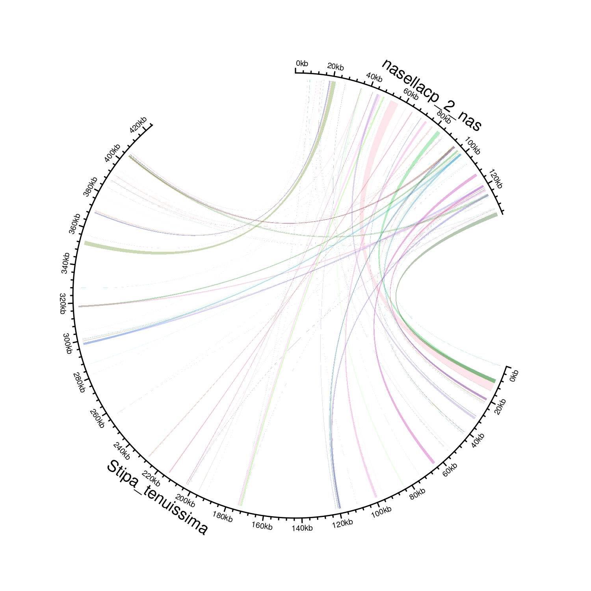

# transgenomes

A BLASTn-based tool for pairwise genomes comparison (https://github.com/drostlab/metablastr).

# Installation

```r
install.packages("devtools")
library(devtools)
devtools::install_github('Mordziarz/transgenomes')
library(transgenomes)
```
To use all features of the program, you will need several libraries.

```r
library(metablastr)
library(circlize)
```

# Input data 

The transfer_function() function accepted two FASTA files (fasta_q and fasta_s) along with two BED files containing gene annotations (bed_q and bed_s). The evalue_cutoff parameter was used to specify the E-value threshold for BLAST results.

The bed should look like this: 
V1 - Genome name,
V2 - Start annotation,
V3 - End annotation,
V4 - Gene name

| V1  | V2 | V3 |   V4  |
| -------- | ----- |    -----   |   -----   |
| Mitogenome  | 0  | 74  | trnD1 |
| Mitogenome  | 270  |   342 |   trnN    |

```r
transfer_function(fasta_q = "fasta_q.fasta",
                  fasta_s = "fasta_s.fasta",
                  bed_q = bed_q,
                  bed_s = bed_s,
                  evalue_cut_off = 0.0001)
```

The transfer_function() function produced an output table enriched with annotations for genes that had undergone partial or complete transfer to the second genome. The q_genes and s_genes columns within this table provided details about these transfers. For instance, the entry "genes: atp1 (1530)/(790)" indicated that the gene atp1, with a total length of 1530 nucleotides, had been transferred, and the transferred portion was 790 nucleotides long.

# Visualization

The program generated a basic visualization using the circlize package (https://github.com/jokergoo/circlize). This visualization was created based on the output from the transfer_function() function.

```r
plot_transfers(transfer_function_out = transfer_function_out,
                gap=40,
                start_degree=90,
                transparency=0.7)
```

Useful functions for image cleaning in R

```r
dev.off()
circlize::circos.clear()
```



# Citation

Paper in preparation

# Support
Any issues connected with the transgenomes should be addressed to Mateusz Mazdziarz (mateusz.mazdziarz@uwm.edu.pl).

# Usage in scientific papers
