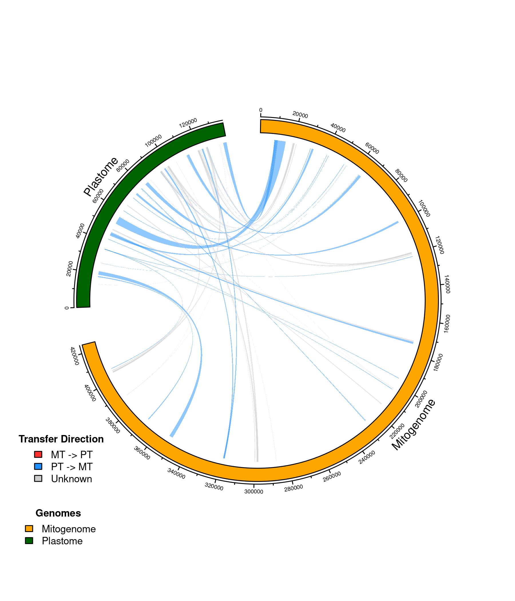
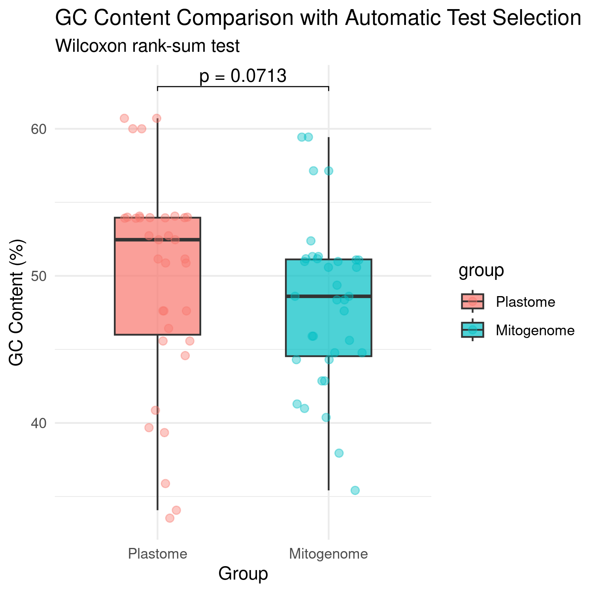
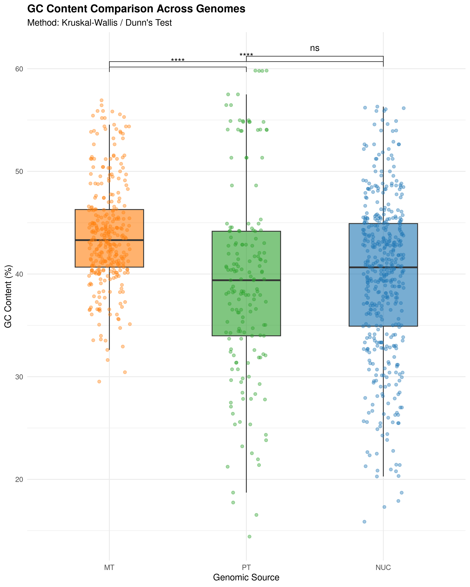

# transgenomes

A BLASTn-based tool for pairwise genomes comparison (https://github.com/drostlab/metablastr).

# Installation

```r
install.packages("devtools")
library(devtools)
devtools::install_github('Mordziarz/transgenomes')
library(transgenomes)
```
To use all features of the program, you will need several libraries.

```r
library(metablastr)
library(circlize)
library(Biostrings)
library(dplyr)
library(rstatix)
library(ggplot2)
library(car)
library(ggpubr)
```

# Input data 

The transfer_function() function accepted two FASTA files (fasta_q and fasta_s) along with two BED files containing gene annotations (bed_q and bed_s). The evalue_cutoff parameter was used to specify the E-value threshold for BLAST results.

The bed should look like this: 
V1 - Genome name,
V2 - Start annotation,
V3 - End annotation,
V4 - Gene name

| V1  | V2 | V3 |   V4  |
| -------- | ----- |    -----   |   -----   |
| OR220799.1  | 0  | 74  | trnD1 |
| OR220799.1  | 270  |   342 |   trnN    |

```r
transfer_function_out <- transfer_function(fasta_mt = "fasta_q.fasta",
                                            fasta_pt = "fasta_s.fasta",
                                            bed_mt = bed_q,
                                            bed_pt = bed_s,
                                            evalue_cut_off = 0.0001 
                                            gene_buffer = 20, 
                                            trans_buffer = 20)
```

The transfer_function() identifies intergenomic transfers by comparing BLASTn alignments against Mitochondrial (MT) and Plastid (PT) feature sets. For each alignment, the function calculates cumulative gene completeness (sum_g_perc) and transfer dominance (sum_t_perc) for both genomes. These metrics are recorded in the mt_genes and pt_genes columns, providing detailed information for each overlapping feature (e.g., atp1 (g_len=1530, ov_len=790, g_perc=51.6%, t_perc=98.5%)).

Crucially, the algorithm ignores tRNA genes (filtered via regex ^trn|tRNA) when determining direction, as these highly conserved sequences are often non-diagnostic for specific transfer events. The final direction—stored in the direction column as MT -> PT, PT -> MT, or unknown—is determined by a two-step comparison of the cumulative metrics:

    1. Gene Completeness: A transfer is assigned if the difference between the MT and PT cumulative gene completeness exceeds the gene_buffer.

    2. Transfer Dominance: If the gene completeness is ambiguous, the direction is determined if the difference in dominance (the proportion of the     alignment covered by any genes) exceeds the trans_buffer.

All decisions, including cases where regions are strictly intergenic or where differences remain below the specified buffers, result in an "unknown" classification to ensure high-confidence results.

# Visualization

The program generated a basic visualization using the circlize package (https://github.com/jokergoo/circlize). This visualization was created based on the output from the transfer_function() function.

```r
plot_transfers(transfer_function_out = transfer_function_out)
```

Useful functions for image cleaning in R

```r
dev.off()
circlize::circos.clear()
```



# Extract transfer regions

The extract_regions() function allows you to extract FASTA sequences from transfer events. Simply provide the output of transfer_function() as the transfer_function_out argument.

```r
regions_s <- extract_regions(transfer_function_out = transfer_1,
                              fasta_path = "inst/extdata/plastome.fasta")
```

# GC content

You can easily compare the GC content between two sets of transfer regions using the analyze_GC_content() function. Group names and significance level can be customized. The function automatically selects the appropriate statistical test based on data distribution and provides a publication-ready plot with p-value annotation, as well as detailed test results.

```r
results_GC <- analyze_GC_content(extract_regions_1 = regions_s, 
                                extract_regions_2 = regions_q,
                                group1_name = "Plastome",
                                group2_name = "Mitogenome",
                                alpha=0.05)

results_GC$plot
results_GC$test_result
results_GC$normality_check
results_GC$test_method
results_GC$gc_data
```



# Nuclear genome

I have enabled users to analyze DNA transfers between the chloroplast, mitochondrion, and nuclear genomes.

The transfer_function_nuclear identifies DNA sequence transfers by performing a three-way genomic comparison between mitochondrial (MT), plastid (PT), and nuclear (NUC) genomes. Using BLASTn as the alignment engine, the function filters hits based on user-defined thresholds for E-value, alignment length, and percent identity to eliminate non-specific sequence noise and incidental similarities.

The core analytical strength lies in its multi-gene annotation engine: for every BLAST hit, the function identifies all overlapping genomic features from provided BED files. Instead of evaluating single genes in isolation, it aggregates (sums) coverage metrics across all features within the alignment boundaries. The direction of transfer (e.g., MT -> NUC) is determined by comparing the total gene completeness and alignment dominance between the query and subject sequences. If the cumulative gene coverage in one genome exceeds the other (controlled by the gene_buffer and trans_buffer parameters), a transfer direction is assigned. This approach is particularly robust for detecting large-scale transfers involving genomic clusters, while a specialized tRNA filter prevents highly conserved, non-diagnostic regions from biasing the results.

```r
transfer_function_nuclear_out <- transfer_function_nuclear(fasta_nuc = "path/to/nuclear/fasta",
                                         fasta_mt ="path/to/mitochondrion/fasta" ,
                                         fasta_pt = "path/to/plastid/fasta",
                                         bed_nuc = bed_nuc,
                                         bed_mt = bed_mt,
                                         bed_pt = bed_pt,
                                         min_length = 100,
                                         evalue_cut_off = 0.000001,
                                         min_identity = 70,
                                         gene_buffer = 20,
                                         trans_buffer = 20)
```

## Output Column Definitions

| Column Name | Description |
| :--- | :--- |
| **query_id** | The identifier of the query sequence (e.g., Mitochondrial or Plastid scaffold). |
| **subject_id** | The identifier of the reference sequence (e.g., Nuclear chromosome). |
| **perc_identity** | Percentage of identical matches between the two sequences. |
| **num_ident_matches** | Total number of identical nucleotides in the alignment. |
| **alig_length** | Total length of the alignment (including gaps). |
| **mismatches** | Number of mismatched nucleotides. |
| **gap_openings** | Number of times a gap was opened in the alignment. |
| **n_gaps** | Total number of gap characters (insertions/deletions). |
| **pos_match** | Number of positive matches (identical residues for DNA). |
| **ppos** | Percentage of positive-scoring matches. |
| **q_start / q_end** | Start and end coordinates of the alignment on the **query** sequence. |
| **q_len** | Total length of the query sequence. |
| **qcov / qcovhsp** | Query coverage per hit and per high-scoring segment pair. |
| **s_start / s_end** | Start and end coordinates of the alignment on the **subject** sequence. |
| **s_len** | Total length of the subject sequence. |
| **evalue** | The Expect value (significance of the hit; lower is better). |
| **bit_score** | Statistical measure of the alignment quality (independent of database size). |
| **direction** | **Predicted transfer direction** (e.g., `PT -> NUC`). Based on gene completeness and alignment dominance. |
| **pt_genes** | Plastid genes overlapping the hit with detailed metrics. |
| **mt_genes** | Mitochondrial genes overlapping the hit with detailed metrics. |
| **nuc_genes** | Nuclear genes/features overlapping the hit with detailed metrics. |

### Annotation Metrics Detail

For each gene identified in the columns above, the following metrics are provided:
- **g_len**: Total length of the gene in the reference BED file.
- **ov_len**: Number of base pairs of the gene covered by the alignment.
- **g_perc (Gene Completeness)**: Percentage of the total gene length present in this transfer.
- **t_perc (Transfer Dominance)**: Percentage of this specific BLAST hit occupied by this gene.

## GC content NUC-PT-MT

```r
results_GC <- analyze_GC_three_genomes(extract_regions_mt = regions_mt,
                                       extract_regions_pt = regions_pt,
                                       extract_regions_nuc= regions_nuc)


results_GC$main_test
results_GC$post_hoc
results_GC$normality
results_GC$gc_data
results_GC$plot
results_GC$method
```



# Citation

Paper in preparation

# Support
Any issues connected with the transgenomes should be addressed to Mateusz Mazdziarz (mateusz.mazdziarz@uwm.edu.pl).

# Usage in scientific papers
