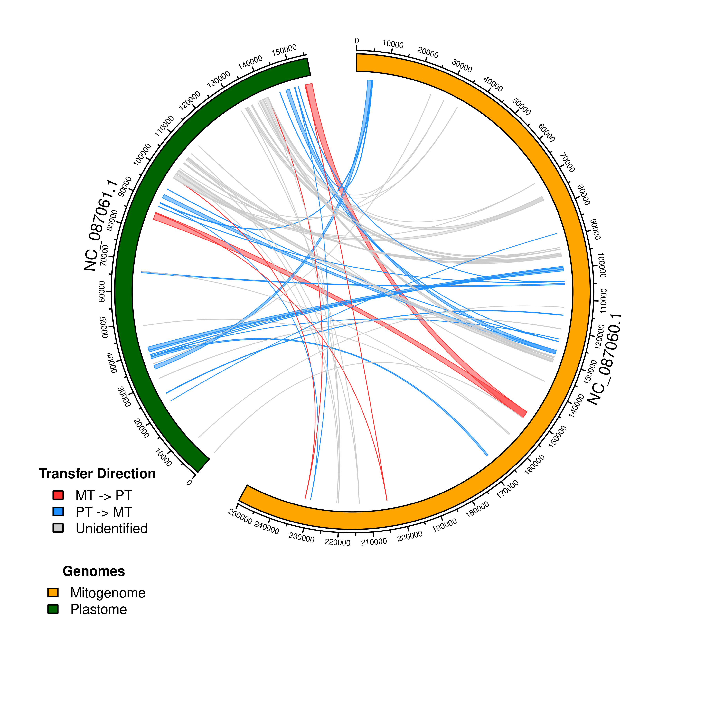
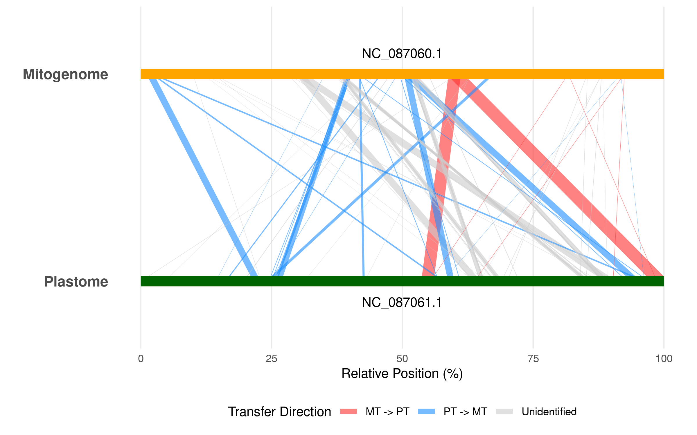
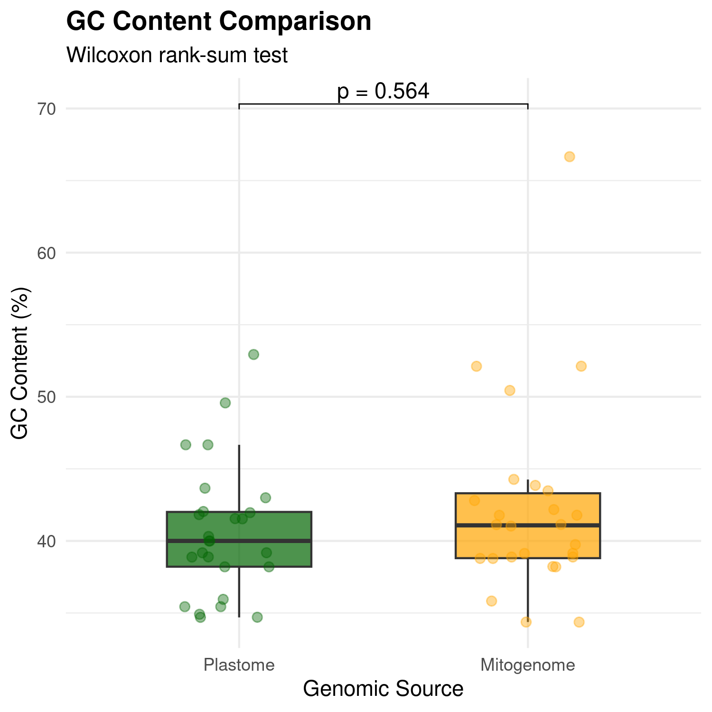

# transgenomes

A BLASTn-based tool for pairwise genomes comparison (https://github.com/drostlab/metablastr).

# Installation

```r
install.packages("devtools")
library(devtools)
devtools::install_github('Mordziarz/transgenomes')
library(transgenomes)
```
To use all features of the program, you will need several libraries.

```r
library(metablastr)
library(circlize)
library(Biostrings)
library(dplyr)
library(rstatix)
library(ggplot2)
library(car)
library(ggpubr)
```

# Input data 

The transfer_function() integrates mitochondrial and plastid sequence data by accepting two FASTA files (fasta_mt and fasta_pt) and their corresponding gene annotations in BED format (bed_mt and bed_pt). The function executes a BLASTn search using a specified evalue_cut_off, subsequently filtering results based on min_length and min_identity to ensure alignment quality. By cross-referencing these alignments with the BED files, it calculates gene coverage metrics to determine the direction of sequence transfer (MT -> PT or PT -> MT).

The bed should look like this: 
V1 - Genome name,
V2 - Start annotation,
V3 - End annotation,
V4 - Gene name

| V1  | V2 | V3 |   V4  |
| -------- | ----- |    -----   |   -----   |
| OR220799.1  | 0  | 74  | trnD1 |
| OR220799.1  | 270  |   342 |   trnN    |

How to convert GFF3 to BED format:

```r
bed_q <- read.csv("/inst/extdata/mito_carrot.gff3",sep="\t",header = F)
bed_s <- read.csv("/inst/extdata/plas_carrot.gff3",sep="\t",header = F)

bed_q <- bed_q[bed_q$V3 %in% c("gene","pseudogene"),]
bed_q$V9 <- gsub(".*Name=([^;]+).*", "\\1", bed_q$V9)
bed_q <- bed_q[,c("V1","V4","V5","V9")]
colnames(bed_q) <- c("V1","V2","V3","V4")

bed_s <- bed_s[bed_s$V3 %in% c("gene","pseudogene"),]
bed_s$V9 <- gsub(".*Name=([^;]+).*", "\\1", bed_s$V9)
bed_s <- bed_s[,c("V1","V4","V5","V9")]
colnames(bed_s) <- c("V1","V2","V3","V4")
```

```r
transfer_function_out <- transfer_function(fasta_mt = "fasta_q.fasta",
                                            fasta_pt = "fasta_s.fasta",
                                            bed_mt = bed_q,
                                            bed_pt = bed_s,
                                            min_length = 40,
                                            evalue_cut_off = 0.000001,
                                            min_identity = 70,
                                            gene_buffer = 20,
                                            trans_buffer = 20)
```
Output:

| Column | Description |
|:---|:---|
| `mt_id` | Identifier of the Mitochondrial sequence (MT). |
| `pt_id` | Identifier of the Plastid sequence (PT). |
| `perc_identity` | Percentage of identical matches. |
| `num_ident_matches` | Number of identical nucleotides in the alignment. |
| `alig_length` | Total length of the alignment (including gaps). |
| `mismatches` | Number of mismatched nucleotides. |
| `gap_openings` | Number of gap opening events. |
| `n_gaps` | Total number of gaps (nucleotides). |
| `pos_match` | Number of positive matches. |
| `ppos` | Percentage of positive matches. |
| `mt_start` / `mt_end` | Start and end positions on the MT sequence. |
| `mt_total_len` | Total length of the MT sequence. |
| `qcov` | Query coverage per unique subject. |
| `qcovhsp` | Query coverage per High-scoring Segment Pair (HSP). |
| `pt_start` / `pt_end` | Start and end positions on the PT sequence. |
| `pt_total_len` | Total length of the PT sequence. |
| `evalue` | Expectation value (statistical significance). |
| `bit_score` | Bit score (normalized quality of alignment). |
| `score_raw` | Raw alignment score. |
| **`mt_genes`** | List of genes found in the MT genome at the alignment site. |
| **`pt_genes`** | List of genes found in the PT genome at the alignment site. |
| **`direction`** | Inferred transfer direction: `MT -> PT`, `PT -> MT`, or `Unidentified`. |

Each gene in `mt_genes` and `pt_genes` is described using the following syntax:  
`GeneName (g_len=X, ov_len=Y, g_perc=Z%, t_perc=W%)`

* **`g_len`**: Total length of the gene in the reference BED file.
* **`ov_len`**: Number of nucleotides from that gene overlapping with the alignment.
* **`g_perc`**: Percentage of the gene sequence covered by the transfer ($(\frac{ov len}{g len}) \times 100$).
* **`t_perc`**: Percentage of the total alignment length occupied by this gene ($(\frac{ov len}{alig length}) \times 100$).

The function determines the `direction` of DNA transfer based on the following improved logic:

1. **Protein-Coding Priority**: If an alignment overlaps with at least one protein-coding gene, all non-coding elements (tRNA/rRNA) are strictly excluded from the statistical calculation. The direction is decided based solely on protein-coding sequences.
2. **Multi-gene Handling**: If multiple protein-coding genes are present on the same side, their coordinates are merged into a single "coding footprint" to calculate unique coverage, ensuring percentages never exceed 100%.
3.  **Strict Non-Coding Rule**: If both sides of the alignment contain **only tRNA or rRNA** (or no genes at all), the direction is automatically marked as **`Unidentified`**. This prevents conserved non-coding sequences from generating false-positive transfer directions.
4.  **Direction Assignment**:
    * **MT -> PT**: Evidence shows the fragment is a protein-coding gene in MT but is potentially non-functional or only non-coding in PT.
    * **PT -> MT**: Evidence shows the fragment originates from a protein-coding gene in the PT genome.
    * **Unidentified**: Assigned if both sides only contain tRNA/rRNA, if no genes are present on either side, or if the difference in protein-coding gene coverage is below the `gene_buffer` / `trans_buffer` thresholds.


# Visualization

The program generated a basic visualization using the circlize package (https://github.com/jokergoo/circlize). This visualization was created based on the output from the transfer_function() function.

```r
plot_transfers(transfer_function_out = transfer_function_out,
               mt_sector_col = "orange",
               pt_sector_col = "darkgreen",
               mt_to_pt_col = "firebrick1",
               pt_to_mt_col = "dodgerblue1",
               unidentified_col = "grey80")
```

Useful functions for image cleaning in R

```r
dev.off()
circlize::circos.clear()
```




The program also generates a basic linear visualization.

```r
plot_transfers2(transfer_function_out = transfer_function_out,
                normalization = T,
                chromosome_gap = 0.1,
                transparency = 0.5,
                mt_sector_col = "orange",
                pt_sector_col = "darkgreen",
                mt_to_pt_col = "firebrick1",
                pt_to_mt_col = "dodgerblue1",
                unidentified_col = "grey80")
```


# Extract transfer regions

The extract_regions() function allows you to extract FASTA sequences from transfer events. Simply provide the output of transfer_function() as the transfer_function_out argument.

```r
regions_s <- extract_regions(transfer_function_out = transfer_1,
                              fasta_path = "inst/extdata/plastome_carot.fasta")
```

# GC content

You can easily compare the GC content between two sets of transfer regions using the analyze_GC_content() function. Group names and significance level can be customized. The function automatically selects the appropriate statistical test based on data distribution and provides a publication-ready plot with p-value annotation, as well as detailed test results.

```r
results_GC <- analyze_GC_content(extract_regions_1 = regions_s, 
                                extract_regions_2 = regions_q,
                                group1_name = "Plastome",
                                group2_name = "Mitogenome",
                                alpha=0.05)

results_GC$plot
results_GC$test_result
results_GC$normality_check
results_GC$test_method
results_GC$gc_data
```



# Citation

Maździarz, M., Krawczyk, K. Transgenomes: automated detection and characterization of mitochondrial-plastid DNA transfers. J Plant Res (2026). https://doi.org/10.1007/s10265-026-01709-0

# Support
Any issues connected with the transgenomes should be addressed to Mateusz Mazdziarz (mateusz.mazdziarz@uwm.edu.pl).

# Usage in scientific papers
